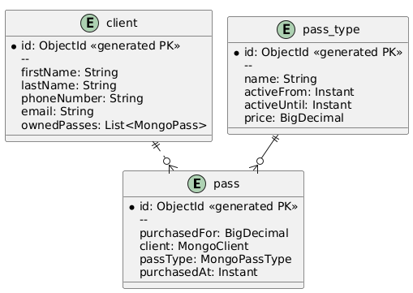

## Intro

Pass management system for *abstract* business,
which spread their services via **passes/memberships**.

Main features:

1. Manipulating clients` passes (buying, canceling, transfering to another etc)
2. Generating reports for pass usages by client, by each pas type per month etc.
3. Client notification about pass type price changing, money spent report generation etc.

## Technologies usage description

### Phase 1

First part of domain/features will be implemented
using MongoDb,
obviously, using **Docker Compose** for database service.

Entity relationship UML diagram for the first stage:

